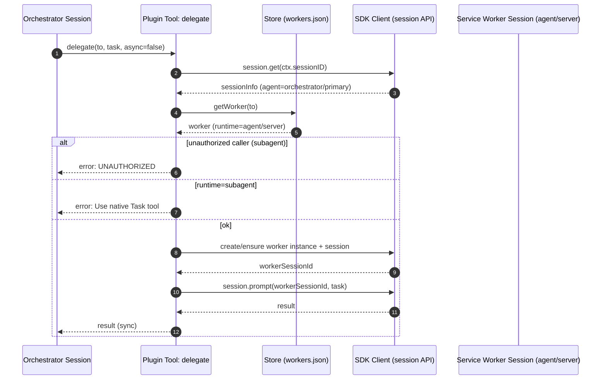
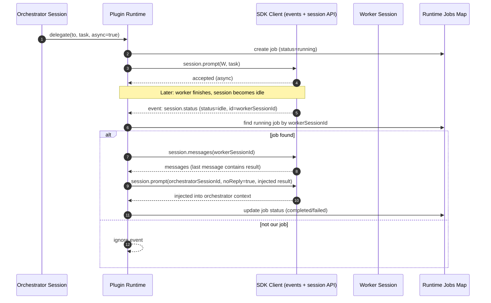
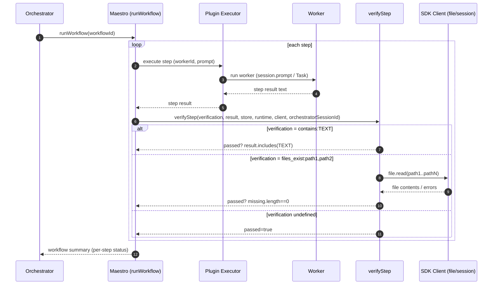
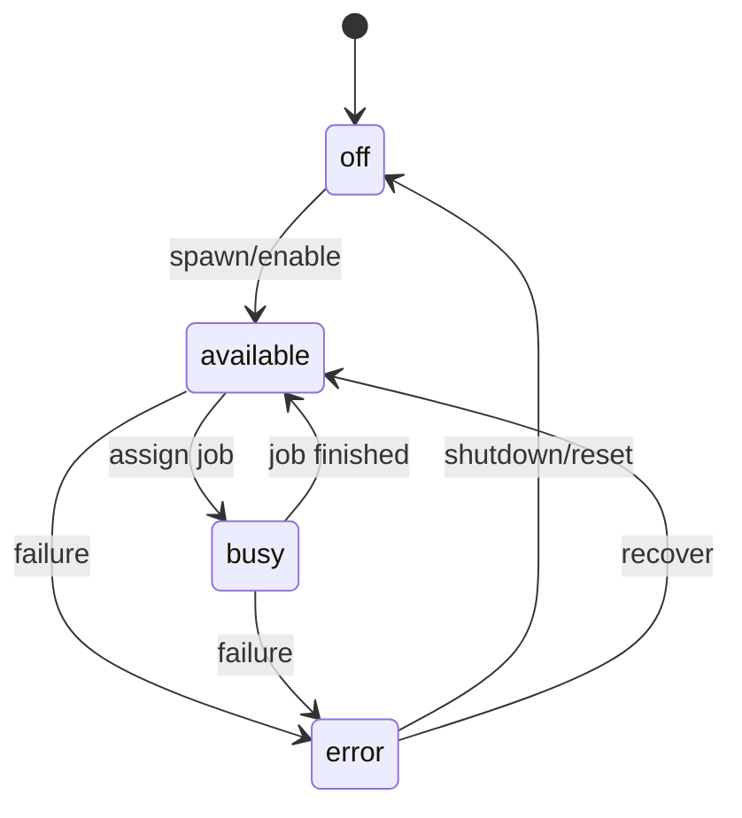
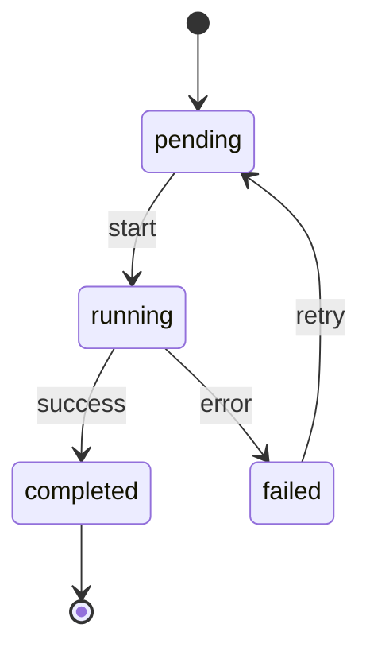

# Orchestra Repository Visual Report (2026-01-16)

A visual, code-backed overview of Orchestra's plugin-based orchestration system: how `packages/plugin` manages workers, jobs, workflows, and integrations; how the UI in `packages/app` surfaces it; and how persistence lives in `.opencode/workforce/*`.

---

## Table of Contents

- [1. Snapshot](#1-snapshot)
- [2. System Map (Mermaid)](#2-system-map-mermaid)
- [3. Core Execution Flows (Sequence Diagrams)](#3-core-execution-flows-sequence-diagrams)
  - [3.1 Sync `delegate` (Orchestrator → Service Worker)](#31-sync-delegate-orchestrator--service-worker)
  - [3.2 Async `delegate` + Wake-up Injection (`session.status` idle)](#32-async-delegate--wake-up-injection-sessionstatus-idle)
  - [3.3 Workflow Execution (`runWorkflow` → step → `verifyStep`)](#33-workflow-execution-runworkflow--step--verifystep)
- [4. State Models (Mermaid)](#4-state-models-mermaid)
  - [4.1 `WorkerStatus` Union](#41-workerstatus-union)
  - [4.2 `Job.status` Union](#42-jobstatus-union)
- [5. Repository Layout (Directory Trees)](#5-repository-layout-directory-trees)
  - [5.1 Root Tree](#51-root-tree)
  - [5.2 Plugin Tree](#52-plugin-tree)
  - [5.3 App Orchestra Pages Tree](#53-app-orchestra-pages-tree)
  - [5.4 Workforce Tree](#54-workforce-tree)
- [6. Key Code Snippets (Verbatim)](#6-key-code-snippets-verbatim)
  - [6.A `delegate` tool authorization + runtime guard](#6a-delegate-tool-authorization--runtime-guard)
  - [6.B Wake-up injection on `session.status: idle`](#6b-wake-up-injection-on-sessionstatus-idle)
  - [6.C Integration health checks + process spawning](#6c-integration-health-checks--process-spawning)
  - [6.D Workflow step verification mode example](#6d-workflow-step-verification-mode-example)
  - [6.E OAuth callback error handling (UI)](#6e-oauth-callback-error-handling-ui)
  - [6.F `verifyStep` verification primitives](#6f-verifystep-verification-primitives)
- [7. Findings](#7-findings)
- [8. Next Questions](#8-next-questions)
- [9. Key References](#9-key-references)

---

## 1. Snapshot

- **Primary orchestration logic**: `packages/plugin` (tools, runtime, workflows, integrations).
- **Primary UI surface area**: `packages/app/src/pages/orchestra/*` (workers, workflows, integrations, memories, servers, tickets).
- **Persistence**: `.opencode/workforce/*` JSON files: workers, integrations, workflows, runtime snapshot, memories, skills, Linear data.
- **Key runtime concept**: jobs + worker sessions, with a **wake-up injection** that feeds async worker results back into orchestrator session when a worker session becomes idle.

---

## 2. System Map (Mermaid)

```mermaid
graph TD
  %% Packages
  App[packages/app<br/>UI: Orchestra pages] -->|reads/writes JSON via SDK| SDK[packages/sdk<br/>HTTP + SSE client]
  SDK -->|file.read/file.write + session.*| Server[OpenCode Server<br/>(sessions, files, tools)]
  Server -->|loads plugin| Plugin[packages/plugin<br/>tools + runtime + store]

  %% Workforce persistence
  Plugin -->|read/write JSON| Workforce[.opencode/workforce/*<br/>workers.json, integrations.json,<br/>workflows/*.json, runtime.json,<br/>memories.json, skills.json, linear.json]
  App -->|renders dashboards| Workforce

  %% Worker execution
  Plugin -->|spawns/queries| ServiceWorkers[Service workers<br/>runtime: agent/server<br/>e.g. docs, memory]
  Plugin -->|tasks| Subagents[Subagents<br/>runtime: subagent<br/>reader/coder/reviewer]

  %% Workflows + verification
  Plugin -->|runWorkflow| Workflows[Workflows<br/>.opencode/workforce/workflows/*.json]
  Plugin -->|verifyStep: contains/files_exist| Server

  %% Async wake-up path
  Server -->|events: session.status| Plugin
  Plugin -->|inject prompt (noReply) into orchestrator session| Server

  %% Integrations
  Plugin -->|spawn processes + health checks| Integrations[Integrations<br/>mcp/http/stdio/env]
  Workforce -->|definitions| Integrations

  %% Orchestrator package (ticketing/Linear)
  OrchestratorPkg[packages/orchestrator<br/>tickets + Linear sync] -->|stores state| OrchestratorData[.opencode/orchestrator/*<br/>(tickets.json, etc.)]
```

---

## 3. Core Execution Flows (Sequence Diagrams)

### 3.1 Sync `delegate` (Orchestrator → Service Worker)



### 3.2 Async `delegate` + Wake-up Injection (`session.status` idle)



### 3.3 Workflow Execution (`runWorkflow` → step → `verifyStep`)



---

## 4. State Models (Mermaid)

### 4.1 `WorkerStatus` Union

State diagram uses **exact union values**:

- `available | busy | off | error`



### 4.2 `Job.status` Union

State diagram uses **exact union values**:

- `pending | running | completed | failed`



---

## 5. Repository Layout (Directory Trees)

### 5.1 Root Tree

```text
orchestra/
├── .git/
├── .opencode/
│   ├── .gitignore
│   ├── agent/
│   ├── bun.lock
│   ├── node_modules/
│   ├── package.json
│   ├── plugin/
│   └── workforce/
├── .pi/
├── packages/
│   ├── app/
│   ├── apps/
│   ├── orchestrator/
│   ├── plugin/
│   ├── sdk/
│   ├── util/
│   └── opencode-plugin-pkg/
├── AGENTS.md
├── bun.lock
├── bunfig.toml
├── docs/
├── .env
├── .gitignore
├── logs/
├── package.json
├── patches/
├── scripts/
├── tsconfig.json
```

### 5.2 Plugin Tree

```text
packages/plugin/
├── src/
│   ├── index.ts
│   ├── integrations.ts
│   ├── linear-client.ts
│   ├── linear-tools.ts
│   ├── linear-types.ts
│   ├── maestro.ts
│   ├── skills.ts
│   ├── store.ts
│   ├── tools.ts
│   └── types.ts
├── test/
│   ├── maestro.test.ts
│   ├── store.test.ts
│   └── tools.test.ts
├── dist/
│   └── index.js
├── package.json
├── .opencode/
└── node_modules/
```

### 5.3 App Orchestra Pages Tree

```text
packages/app/src/pages/
├── orchestra/
│   ├── orchestra.tsx
│   ├── orchestra-data.ts
│   ├── orchestra-data.test.ts
│   ├── orchestra-integration-edit-form.tsx
│   ├── orchestra-issue-create.tsx
│   ├── orchestra-issue-detail.tsx
│   ├── orchestra-kanban.tsx
│   ├── orchestra-kanban-card.tsx
│   ├── orchestra-kanban-column.tsx
│   ├── orchestra-linear-tags.tsx
│   ├── orchestra-memories-tab-helpers.ts
│   ├── orchestra-memories-tab.test.tsx
│   ├── orchestra-memories-tab.tsx
│   ├── orchestra-memory-utils.test.ts
│   ├── orchestra-memory-utils.ts
│   ├── orchestra-model-selector.tsx
│   ├── orchestra-servers-tab-helpers.ts
│   ├── orchestra-servers-tab.test.tsx
│   ├── orchestra-servers-tab.tsx
│   ├── orchestra-sheet.tsx
│   ├── orchestra-skills-tab.tsx
│   ├── orchestra-summary.ts
│   ├── orchestra-tags.tsx
│   ├── orchestra-ticket-edit-form.tsx
│   ├── orchestra-tickets-tab-helpers.ts
│   ├── orchestra-tickets-tab.tsx
│   ├── orchestra-types.ts
│   ├── orchestra-utils.ts
│   ├── orchestra-worker-edit-form.tsx
│   ├── orchestra-workers-tab-helpers.ts
│   ├── orchestra-workers-tab.test.tsx
│   ├── orchestra-workers-tab.tsx
│   ├── orchestra-workflow-edit-form.tsx
│   ├── orchestra-workflows-tab-helpers.ts
│   ├── orchestra-workflows-tab.test.tsx
│   └── orchestra-workflows-tab.tsx
├── session.tsx
├── layout.tsx
├── error.tsx
├── directory-layout.tsx
└── home.tsx
```

### 5.4 Workforce Tree

```text
.opencode/workforce/
├── skills.json
├── memories.json
├── runtime.json
├── linear.json
├── workers.json
├── integrations.json
└── workflows/
    └── workpack.json
```

---

## 6. Key Code Snippets (Verbatim)

### 6.A `delegate` tool authorization + runtime guard

`packages/plugin/src/tools.ts:239-273`

```ts
    delegate: tool({
      description: "Spawn SERVICE agents (docs, memory) that stay alive. NEVER use for reader/coder/reviewer - those are subagents that MUST use the native Task tool. Only for runtime:agent or runtime:server workers.",
      args: {
        to: tool.schema.string().describe("Service worker ID like 'docs' or 'memory' (NOT 'reader', 'coder', 'reviewer' - those MUST use Task tool)"),
        task: tool.schema.string().describe("The task to delegate"),
        async: tool.schema.boolean().optional().describe("Run asynchronously (default: false). Always use async:true for service agents.")
      },
      async execute(args, ctx) {
        // CRITICAL: Only orchestrator should use delegate
        // Get current session info to verify caller
        const sessionInfo = await client.session.get({ path: { id: ctx.sessionID } }).catch(() => null)
        const sessionAgent = (sessionInfo?.data as any)?.agent

        // If this is being called from a subagent (reader, coder, reviewer), REJECT
        if (sessionAgent && !["orchestrator", "primary"].includes(sessionAgent)) {
          return JSON.stringify({
            error: "UNAUTHORIZED: delegate tool can only be used by the orchestrator",
            hint: "Subagents (reader, coder, reviewer) must use Task tool for spawning or query tool for asking services questions.",
            calledFrom: sessionAgent
          })
        }

        // Check worker runtime first
        const worker = await store.getWorker(args.to)
        if (!worker) {
          return JSON.stringify({ error: `Worker not found: ${args.to}` })
        }

        // Reject subagent runtime - should use native Task tool
        if (worker.runtime === "subagent") {
          return JSON.stringify({
            error: `Worker "${args.to}" has runtime:subagent. Use the native Task tool instead: Task(subagent_type: "${args.to}", prompt: "...")`,
            hint: "The delegate tool is only for agent and server runtime workers."
          })
        }
```

### 6.B Wake-up injection on `session.status: idle`

`packages/plugin/src/index.ts:107-166`

```ts
      // Wake-up mechanism: when a worker session goes idle,
      // inject result back to orchestrator session as if user message
      if (event.type === "session.status") {
        const payload = event.properties as any

        // DEBUG: Write to file instead of console
        if (payload?.status === "idle") {
          const idleSessionId = payload.id ?? payload.sessionId
          if (!idleSessionId) return

          // Check if this is one of our jobs
          let foundJob = false
          for (const [, job] of runtime.jobs) {
            if (job.status === "running" && job.workerSessionId === idleSessionId) {
              foundJob = true
              break
            }
          }

          // Write debug info to file
          const logDir = join(directory, ".opencode", "workforce")
          await mkdir(logDir, { recursive: true })
          await appendFile(
            join(logDir, "debug.log"),
            `[${new Date().toISOString()}] Session ${idleSessionId} went idle. Found job: ${foundJob}. Total running jobs: ${Array.from(runtime.jobs.values()).filter(j => j.status === "running").length}\n`
          )

          // Find jobs waiting on this session
          for (const [, job] of runtime.jobs) {
            if (job.status === "running" && job.workerSessionId === idleSessionId) {
              // Get worker instance (needed for both success and failure paths)
              const instance = runtime.instances.get(job.workerInstanceId)

              try {
                // Fetch last messages from worker session
                const msgs = await client.session.messages({ path: { id: idleSessionId } })
                const messages = msgs.data ?? []
                const lastMsg = messages[messages.length - 1]

                // Extract text from last message
                const parts = (lastMsg as any)?.parts ?? []
                const textParts = parts
                  .filter((p: any) => p.type === "text")
                  .map((p: any) => p.text)
                const resultText = textParts.join("\n")

                // Get worker info
                const workerId = instance?.workerId ?? "unknown"

                // Inject result into orchestrator session as user-like message
                await client.session.prompt({
                  path: { id: job.orchestratorSessionId },
                  body: {
                    noReply: true, // Don't trigger AI response yet, just inject context
                    parts: [{
                      type: "text",
                      text: `[Worker "${workerId}" completed job ${job.jobId}]\n\n${resultText}`
                    }]
                  }
                })
```

### 6.C Integration health checks + process spawning

`packages/plugin/src/integrations.ts:28-48,105-135`

```ts
async function waitForHealth(check: string, timeoutMs: number): Promise<void> {
  const start = Date.now()

  while (Date.now() - start < timeoutMs) {
    try {
      if (check.startsWith("http")) {
        // HTTP health check
        const response = await fetch(check)
        if (response.ok) return
      } else {
        // Command health check - not implemented yet
        // Could use Bun.spawn to run command
      }
    } catch {
      // Health check failed, retry
    }
    await new Promise(resolve => setTimeout(resolve, 500))
  }

  throw new Error(`Health check timed out after ${timeoutMs}ms: ${check}`)
}
```

```ts
      // Handle based on process type
      if (def.process) {
        try {
          instance.port = def.process.port

          // Only spawn if there's a command (mcp, stdio types)
          if (def.process.command) {
            const args = def.process.args ?? []
            const env = { ...process.env, ...(def.process.env ?? {}) }
            const cwd = def.process.cwd ?? process.cwd()

            // Use Bun.spawn for process management
            const proc = Bun.spawn([def.process.command, ...args], {
              cwd,
              env,
              stdout: "pipe",
              stderr: "pipe"
            })

            instance.process = proc
          }

          // Wait for health check if specified (works for both spawned and external)
          if (def.process.healthCheck) {
            await waitForHealth(def.process.healthCheck, 30000)
          } else if (def.process.command) {
            // Only wait for spawned processes without health check
            await new Promise(resolve => setTimeout(resolve, 1000))
          }

          instance.status = "ready"

        } catch (err: any) {
          instance.status = "error"
          instance.error = err?.message ?? String(err)
          throw err
        }
```

### 6.D Workflow step verification mode example

`.opencode/workforce/workflows/workpack.json:14-20`

```json
    {
      "step": 1,
      "name": "Implementation",
      "worker": "builder",
      "prompt": "Based on the task, implement the required changes.",
      "verification": "delegate:reviewer"
    }
```

### 6.E OAuth callback error handling (UI)

`packages/app/src/components/dialog-connect-provider.tsx:353-356`

```ts
                      const result = await globalSDK.client.provider.oauth.callback({
                        providerID: props.provider,
                        method: store.methodIndex,
                      })
                      if (result.error) {
                        // TODO: show error
                        dialog.close()
                        return
                      }
```

### 6.F `verifyStep` verification primitives

`packages/plugin/src/maestro.ts:42-86`

```ts
async function verifyStep(
  verification: string | undefined,
  result: string,
  store: Store,
  _runtime: Runtime,
  client: Client,
  orchestratorSessionId: string
): Promise<{ passed: boolean; type: string; message?: string }> {
  if (!verification) {
    return { passed: true, type: "none" }
  }

  // contains:TEXT - check if result contains text
  if (verification.startsWith("contains:")) {
    const expected = verification.slice("contains:".length)
    const passed = result.includes(expected)
    return {
      type: "contains",
      passed,
      message: passed ? `Found "${expected}"` : `Missing "${expected}"`
    }
  }

  // files_exist:path1,path2 - check files exist
  if (verification.startsWith("files_exist:")) {
    const paths = verification.slice("files_exist:".length).split(",").map(p => p.trim())
    const missing: string[] = []

    for (const path of paths) {
      try {
        const resp = await client.file.read({ query: { path } })
        if (!resp.data?.content) {
          missing.push(path)
        }
      } catch {
        missing.push(path)
      }
    }

    return {
      type: "files_exist",
      passed: missing.length === 0,
      message: missing.length === 0 ? "All files exist" : `Missing: ${missing.join(", ")}`
    }
  }
```

---

## 7. Findings

| Strengths | Risks | Quick wins |
|---|---|---|
| Clear separation: UI (`packages/app`) vs runtime (`packages/plugin`) vs API client (`packages/sdk`) | Async job completion depends on `session.status: idle` semantics; edge cases if session never reports idle | Add explicit job terminalization (timeouts/heartbeat) alongside idle-based completion |
| Strong guardrails: `delegate` rejects subagent callers and subagent runtimes | `.opencode/workforce/debug.log` growth/retention unclear | Add log rotation/size cap; optionally surface recent debug entries in UI |
| File-based persistence is transparent and easy to debug | Verification primitives limited (`contains`, `files_exist`) | Add optional `regex:` / `json_valid:` verification types |
| Integrations support spawn + health checks | Command-based health checks are "not implemented yet" | Implement command health checks with timeouts |
| Workflow verification pattern exists (`delegate:reviewer`) | UI closes OAuth dialog on error (`// TODO: show error`) | Add toast/banner with error details + retry |

---

## 8. Next Questions

1. Should async jobs be considered **complete on idle**, or require an explicit "done marker" from the worker?
2. What's the canonical source of truth for worker/job state: runtime maps, `.opencode/workforce/runtime.json`, or session metadata?
3. Do you want workflows to support **parallel steps**, or keep strict sequential execution?
4. For integrations, do you want **auto-restart/backoff**, and where should that policy live?
5. What level of **auditability** should exist: should delegated prompts/results be persisted to disk (and how should secrets be redacted)?

---

## 9. Key References

- `docs/PLUGIN.md`
- `packages/plugin/src/tools.ts`
- `packages/plugin/src/index.ts`
- `packages/plugin/src/integrations.ts`
- `packages/plugin/src/maestro.ts`
- `packages/plugin/src/types.ts`
- `.opencode/workforce/workers.json`
- `.opencode/workforce/integrations.json`
- `.opencode/workforce/runtime.json`
- `.opencode/workforce/workflows/workpack.json`
- `packages/app/src/pages/orchestra/orchestra.tsx`
- `packages/app/src/components/dialog-connect-provider.tsx`
